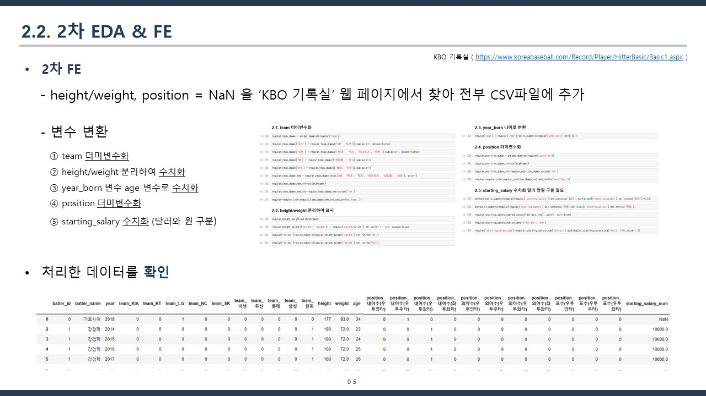

# 머신러닝을 활용하여 타자 OPS 예측 모델 구현

## 🧑‍💻 프로젝트 팀원
- 김민기
- 문석진
- 장우재
- 방희수

## 📄 프로젝트 개요
- 해당 프로젝트는 DACON 대회 중 연습으로 올라와 있는 대회에 참여하여 진행했으며, 학교 기말 프로젝트에서 발표를 진행하였다.
- 대회명 : KBO 타자 OPS 예측 경진대회
- 대회 주제 : 주어진 타자의 데이터를 활용하여 다음년도 OPS 예측
- 대회 주소 : https://dacon.io/competitions/official/62540/overview/description
- 프로젝트 기간 : 2020-10-27 ~ 2020-12-07

## 🎤 프로젝트 발표 PPT

## ❗ 소감
- Python과 Jupyter Notebook을 처음으로 사용한 첫 데이터 분석 및 머신러닝 활용 프로젝트이기 때문에 어려우면서도 매우 흥미로웠다.
- 앞으로 머신러닝에 대한 깊은 공부를 해보고 싶다.
- Python에 조금 익숙해져 매우 만족스럽다.

## 💔 아쉬운 점
- 연습 대회이기 때문에 머신러닝으로 예측된 결과의 정확도를 확인할 수 없어 아쉬웠다.
- error 처리가 너무 어려웠다.
- 팀원들에 비해 코딩 실력이 많이 낮아 조금 아쉬웠다.